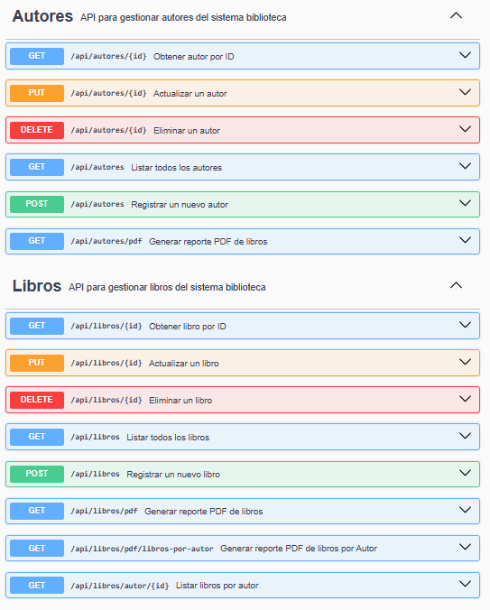
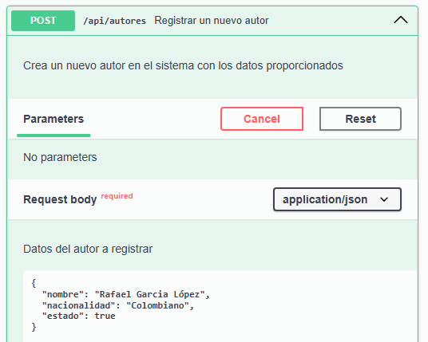
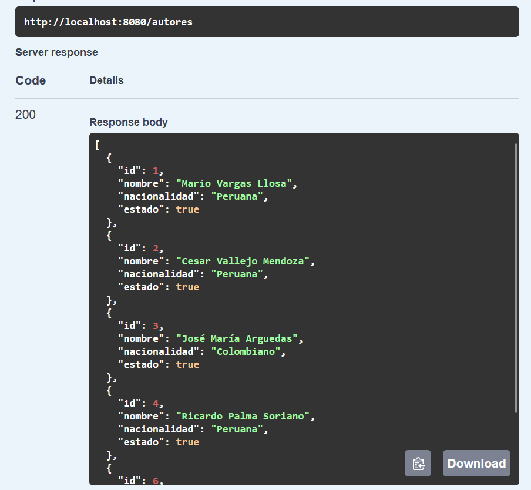
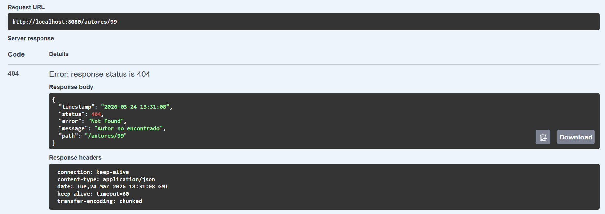
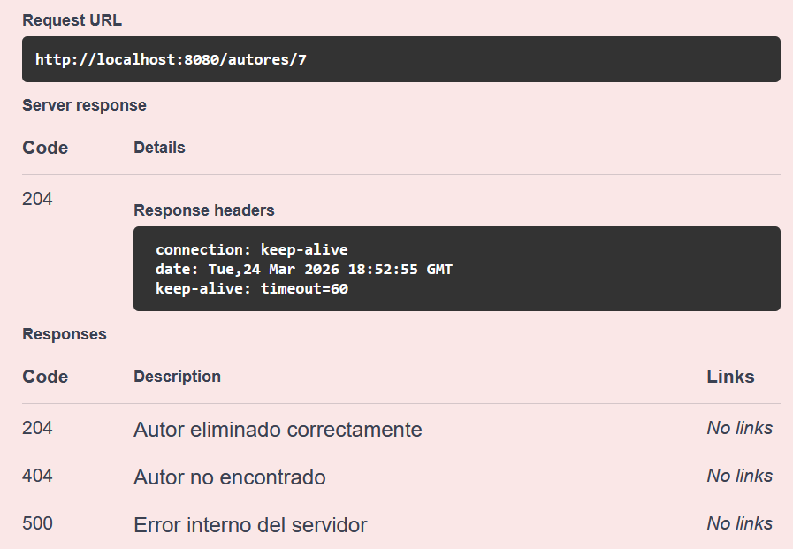
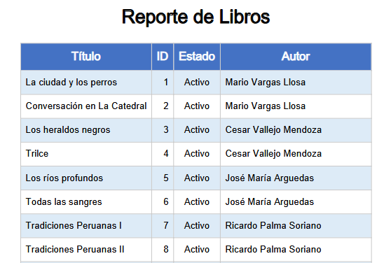

# 📚 Biblioteca API

API REST desarrollada con Spring Boot para la gestión de autores y libros. 
Incluye operaciones CRUD completas, validaciones en capa de servicio y manejo global de excepciones con respuestas estructuradas.

Este proyecto fue diseñado siguiendo buenas prácticas de arquitectura en capas (Controller, Service, Repository) y orientado a ser consumido por múltiples clientes frontend.

---

## 🚀 Tecnologías utilizadas

- Java 17
- Spring Boot
- Spring Web
- Spring Data JPA
- Hibernate
- MySQL
- Swagger (OpenAPI)
- Logging (SLF4J + Logback)

---

## ⚙️ Cómo ejecutar el proyecto

1. Clonar el repositorio
2. Abrir el proyecto en tu IDE (NetBeans, IntelliJ o Eclipse)
3. Configurar la base de datos en el archivo `application.properties`
4. Ejecutar la aplicación

La API estará disponible en:
http://localhost:8080/api

Swagger UI:
http://localhost:8080/swagger-ui.html

---

## 📌 Endpoints principales

### Crear autor
POST /api/autores

### Obtener autor por ID
GET /api/autores/{id}

### Actualizar autor
PUT /api/autores/{id}

### Eliminar autor
DELETE /api/autores/{id}

---

## ⚠️ Manejo de errores

La API implementa un manejo global de excepciones utilizando `@ControllerAdvice`, retornando respuestas estructuradas en formato JSON.

Ejemplo de error:

```json
{
  "timestamp": "2026-03-15T10:30:00",
  "status": 404,
  "error": "Not Found",
  "message": "El autor no existe",
  "path": "/autores/10"
}
```

---

## 📸 Capturas

### Swagger Overview


### Crear autor (POST)


### Obtener autores


### Error 404


### Eliminación exitosa


### Reporte PDF



## 🗄️ Base de datos

El proyecto utiliza MySQL.

Para inicializar la base de datos, ejecutar el script ubicado en:

database/biblioteca-db.sql

Asegúrate de configurar correctamente las credenciales en el archivo `application.properties`.